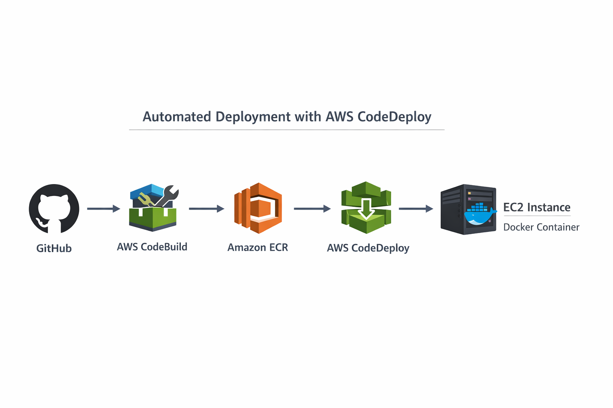
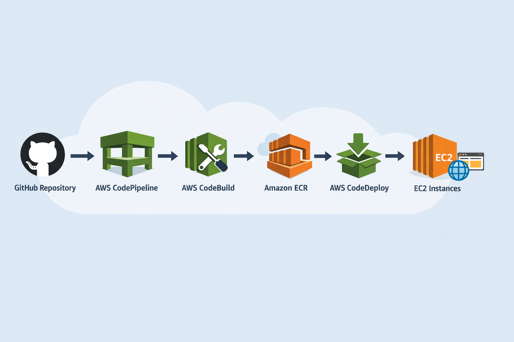

# AWS CI/CD Pipeline for a Dockerized Web Application

## Project Objective
Design and implement an end-to-end AWS CI/CD pipeline that automatically builds, tests, containerizes, and deploys a web application to EC2 using AWS CodePipeline, CodeBuild, CodeDeploy, and ECR.

---

## Overview
This project demonstrates the incremental design and implementation of a production-ready CI/CD pipeline on AWS for a containerized web application.

The emphasis is on DevOps fundamentals, automation discipline, secure authentication, and cost-aware cloud operations, following a structured phase-by-phase engineering approach rather than one-click deployments.

---

## Final CI/CD Flow

GitHub → CodePipeline → CodeBuild → Amazon ECR → CodeDeploy → EC2

A code push to GitHub automatically:

1. Triggers CodePipeline  
2. Builds a Docker image via CodeBuild  
3. Pushes the image to Amazon ECR  
4. Deploys the updated container to EC2 using CodeDeploy  
5. Restarts the application without manual intervention  

---

## Architecture

### Phase 1 — Dockerized Application (Local)

A minimal Flask-based web application is developed and containerized using Docker.  
The application is validated locally to ensure deterministic runtime behavior.

---

### Phase 2 — EC2 & Amazon ECR Integration

An EC2 instance is provisioned and integrated with a private Amazon ECR repository using an IAM role.  
Manual image push and pull operations validate secure container distribution.

---

### Phase 3 — Build Automation with AWS CodeBuild

AWS CodeBuild automates Docker image creation using buildspec.yml.  
Images are automatically built and pushed to Amazon ECR, establishing Continuous Integration.

---

### Phase 4 — Deployment Automation with AWS CodeDeploy

AWS CodeDeploy automates container deployment to EC2 via lifecycle hooks:

- Stop existing container  
- Authenticate to Amazon ECR  
- Pull latest image  
- Start updated container  

Manual SSH-based deployments are eliminated.

---

### Phase 5 — Full Orchestration with AWS CodePipeline

AWS CodePipeline orchestrates the complete CI/CD workflow:

- GitHub webhook triggers pipeline  
- CodeBuild builds and pushes Docker image  
- CodeDeploy updates EC2 automatically  
- Application refreshes with zero manual interaction  

A Git push now results in automatic production deployment.

---

## Key Technical Highlights

- Dockerized Python web application  
- IAM role-based authentication (no static credentials)  
- ECR token auto-refresh inside deployment lifecycle  
- Automated container replacement strategy  
- GitHub webhook-driven pipeline execution  
- Clean separation of CI and CD stages  
- Cost-aware resource management  

---

## Security Design

- EC2 uses IAM role with least-privilege ECR access  
- No hardcoded AWS credentials  
- SSH restricted to My IP  
- Public HTTP exposed only for application validation  
- Temporary ECR authentication tokens generated during deployment  

---

## Cost Awareness Strategy

- EC2 instance stopped after validation  
- Only one pipeline created  
- No NAT Gateway usage  
- Minimal resource footprint  
- Deployment validated without load generation  

This project demonstrates responsible cloud usage alongside automation engineering.

---

## Phase Completion Status

- Phase 0 — Planning & Repository Setup ✅  
- Phase 1 — Application Development & Dockerization ✅  
- Phase 2 — EC2 & Amazon ECR Setup ✅  
- Phase 3 — Build Automation (AWS CodeBuild) ✅  
- Phase 4 — Deployment Automation (AWS CodeDeploy) ✅  
- Phase 5 — End-to-End CI/CD Orchestration (AWS CodePipeline) ✅  

---

## Project Outcome

By the end of this project:

- Continuous Integration implemented  
- Continuous Deployment implemented  
- End-to-end CI/CD automation achieved  
- Secure container lifecycle management validated  
- Real-world deployment debugging handled (IAM permissions, token expiry, lifecycle failures)  

This repository reflects a production-style CI/CD architecture implemented step-by-step with validation at every phase.

---

## Author

Dilman Sandhu  
Aspiring DevOps / Cloud Engineer  

GitHub: https://github.com/dilman0812  
Email: contact.dilman@gmail.com
