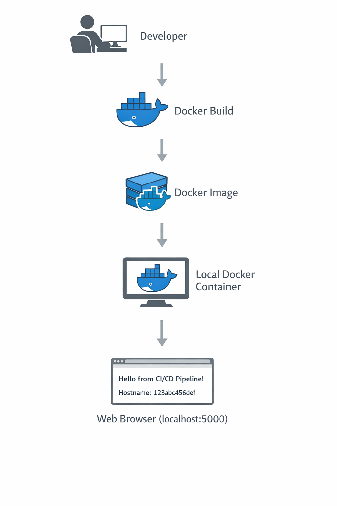
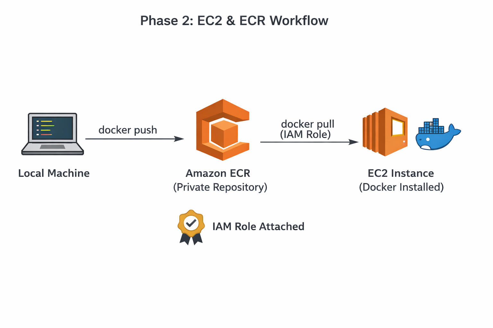
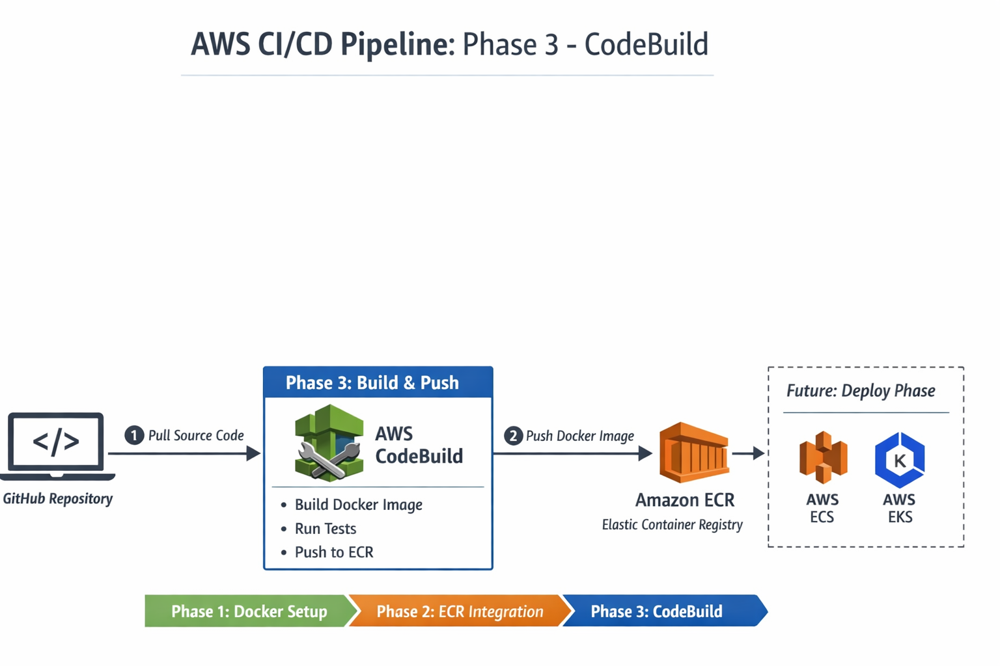

# AWS CI/CD Pipeline for a Dockerized Web Application

## Project Objective
Design and implement an end-to-end AWS CI/CD pipeline that automatically builds, tests, containerizes, and deploys a web application to EC2 using AWS CodePipeline, CodeBuild, CodeDeploy, and ECR.

---

## Overview
This project demonstrates the incremental design and implementation of a production-ready CI/CD pipeline on AWS for a containerized web application.

The emphasis is on **DevOps fundamentals, automation discipline, and reproducibility**, following a phase-by-phase approach similar to real-world engineering workflows rather than one-click deployments.

---

## CI/CD Flow
GitHub → CodePipeline → CodeBuild → Amazon ECR → CodeDeploy → EC2

---

## Architecture

### Phase 1 — Dockerized Application (Local)

In this phase, a minimal web application is developed and packaged into a Docker container.  
The application is built and validated locally to ensure consistent runtime behavior before introducing any AWS CI/CD services.

---

### Phase 2 — EC2 & Amazon ECR Integration

In this phase, AWS infrastructure required for container distribution is introduced.  
A Free Tier Amazon EC2 instance is provisioned and integrated with a private Amazon ECR repository using an IAM role.

The Docker image built in Phase 1 is manually pushed from the local environment to ECR and then securely pulled onto the EC2 instance using IAM-based authentication, without relying on long-lived access keys.

This phase validates the complete container image lifecycle between local development, Amazon ECR, and EC2, forming the foundation for automated CI/CD in later phases.

---

### Phase 3 — Build Automation with AWS CodeBuild

In this phase, build automation is introduced using AWS CodeBuild.  
The source code is pulled directly from GitHub, the Docker image is built inside AWS using a declarative `buildspec.yml`, and the resulting image is automatically pushed to Amazon ECR.

This phase establishes a true Continuous Integration (CI) foundation by eliminating local build dependency while intentionally excluding deployment and pipeline orchestration.

---

## Phase Breakdown
- Phase 0: Project Planning & Repository Setup ✅
- Phase 1: Application Development & Dockerization ✅
- Phase 2: EC2 & Amazon ECR Setup ✅
- Phase 3: Build Automation (AWS CodeBuild) ✅
- Phase 4: Deployment Automation (AWS CodeDeploy)
- Phase 5: End-to-End CI/CD Pipeline (AWS CodePipeline)

---

## Status
Phase 3 completed.  
Docker image builds are fully automated within AWS and published to Amazon ECR, preparing the project for deployment automation in the next phase.

