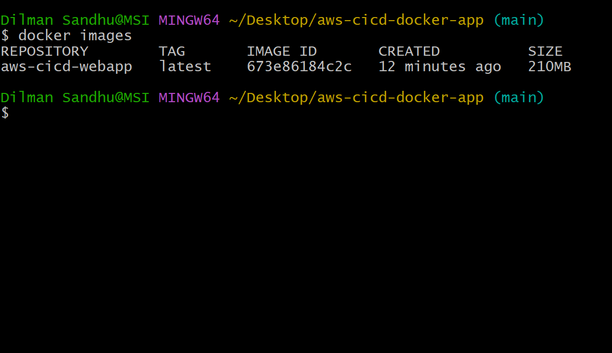
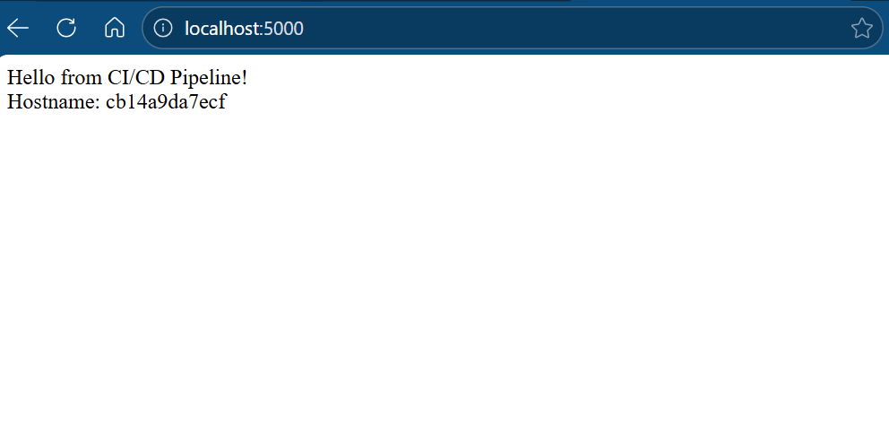

# Phase 1 — Application Development & Dockerization

## Objective
Develop a minimal web application and package it into a Docker container to establish a consistent, reproducible runtime environment before introducing any AWS CI/CD services.

This phase focuses purely on **application fundamentals and containerization**, with all validation performed locally to eliminate cloud-related variables and risk.

---

## Application Overview
A simple web application is implemented to serve as a CI/CD workload.  
The application responds with a static message and the container hostname to clearly demonstrate that it is running inside a Docker container.

Key characteristics:
- Minimal application logic
- Single HTTP endpoint
- Designed for clarity, not feature richness

---

## Dockerization Approach
The application is packaged using Docker to ensure:
- Consistent runtime behavior
- Environment parity across local, CI, and cloud stages
- Immutable build artifacts for later pipeline stages

A production-friendly Dockerfile is used with:
- A slim base image
- Explicit dependency installation
- Clear separation of build layers

---

## Validation Performed

The following validations were completed locally:

### Docker Image Build
The Docker image was built successfully using the project Dockerfile.

**Evidence:**

---

### Docker Image Verification
The built image is present in the local Docker image registry.

**Evidence:**

---

### Application Runtime Validation
The container was started locally, and the application was accessed via a browser using port mapping.

The hostname displayed confirms execution inside a Docker container.

**Evidence:**

---

### Container State Verification (Optional)
The running container was verified using Docker CLI tooling.

**Evidence:**

---

## Key Decisions
- Application complexity kept intentionally minimal
- Docker chosen as the standard packaging mechanism
- Local validation enforced before any AWS integration
- No CI/CD services introduced in this phase

---

## Outcome
By the end of Phase 1:
- The application runs successfully inside a Docker container
- The container exposes a predictable interface
- The Docker image serves as a stable artifact for future CI/CD stages

This phase establishes the foundation required for integrating Amazon ECR, CodeBuild, and CodeDeploy in subsequent phases.

