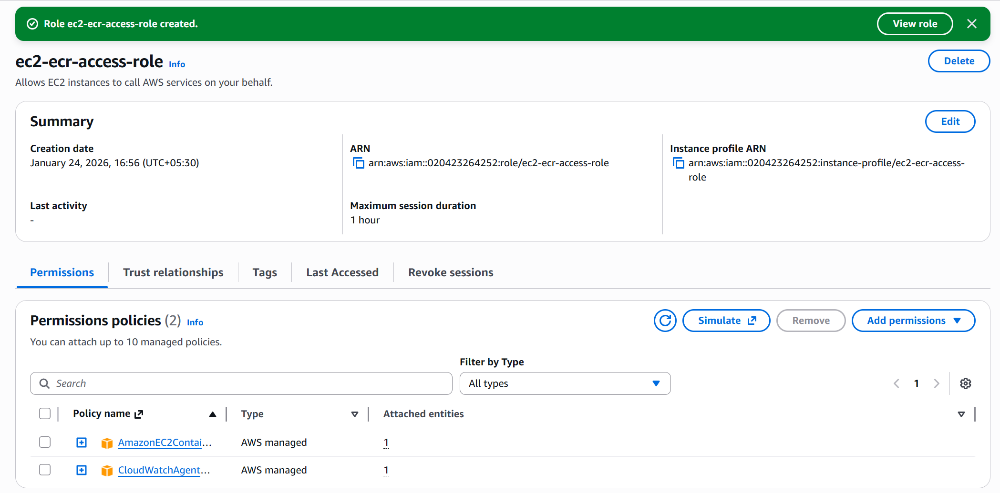
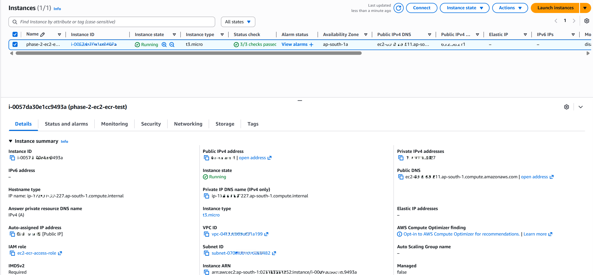
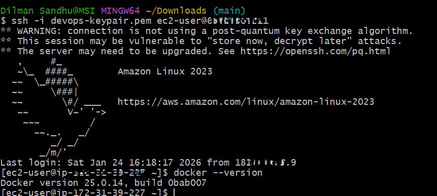
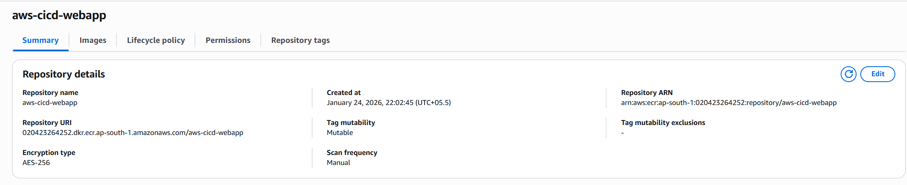
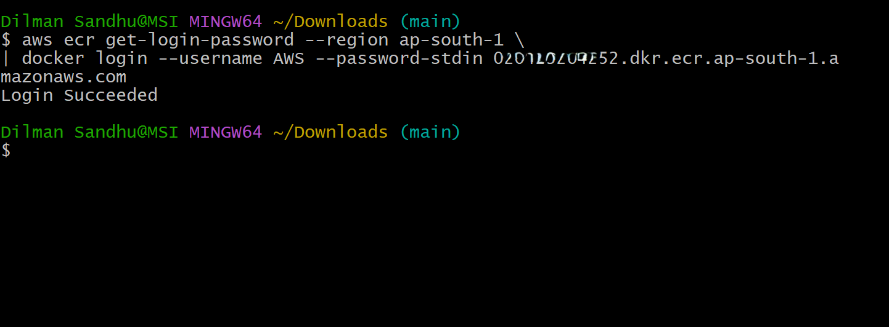
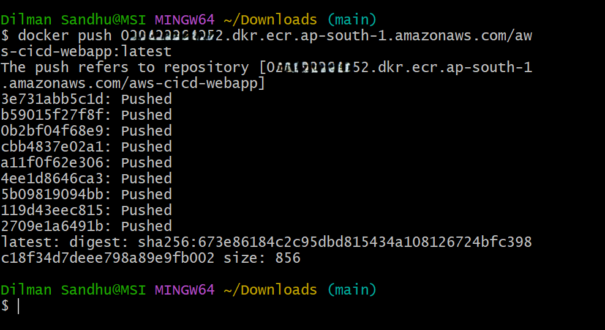
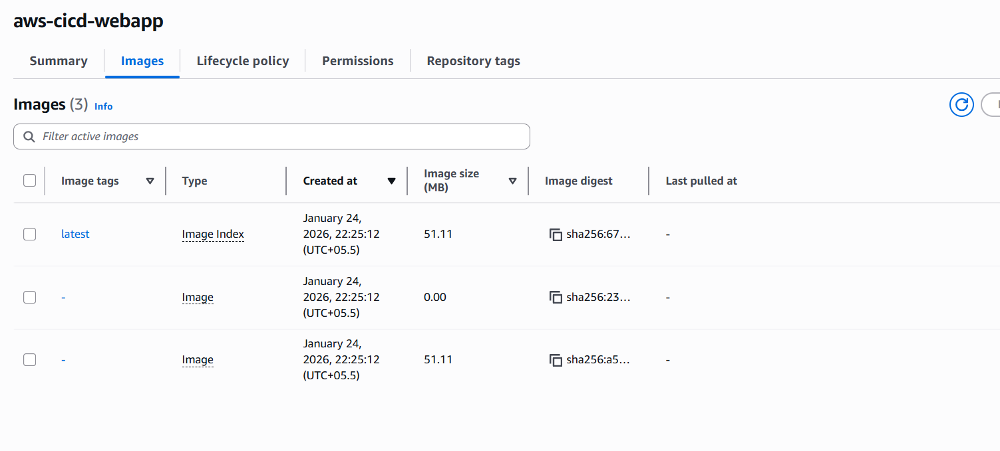
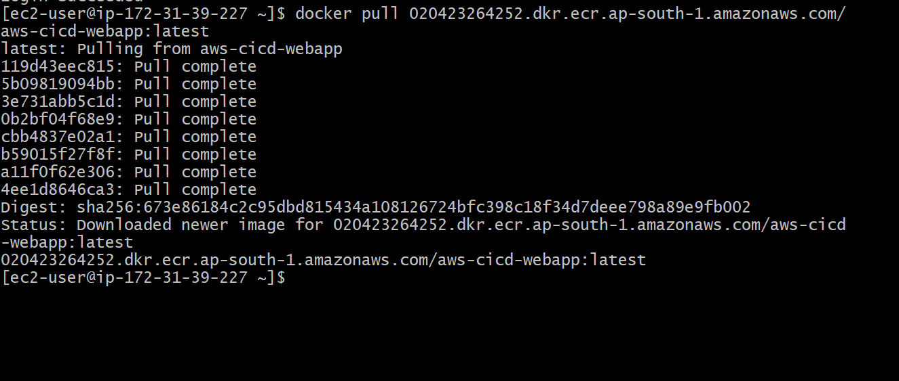
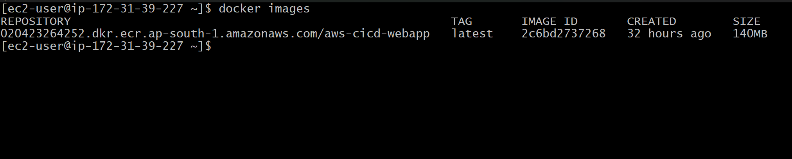

# Phase 2 — EC2 & Amazon ECR Setup

## Objective
Establish the foundational AWS infrastructure required to store and distribute container images by integrating Amazon EC2 with Amazon ECR using IAM roles.

This phase focuses on **compute readiness and container registry integration**, validated through manual Docker operations, without introducing CI/CD automation.

---

## Infrastructure Overview
In this phase, an EC2 instance is provisioned to act as the compute environment, while Amazon ECR is used as a private container registry.  
Secure access between EC2 and ECR is enabled using an IAM role, eliminating the need for long-lived credentials.

---

## Key Components Introduced

### Amazon EC2
- Free Tier eligible EC2 instance launched in `ap-south-1`
- Amazon Linux 2023 AMI
- Docker installed and configured for non-root usage
- IAM role attached at instance launch

### Amazon ECR
- Private ECR repository created to store Docker images
- Used as the single source of truth for container artifacts

### IAM Role
- EC2 instance profile configured with:
  - `AmazonEC2ContainerRegistryReadOnly`
- Enables secure image pull operations without access keys

---

### IAM Role Configuration
An IAM role was created and attached to the EC2 instance to enable secure access to Amazon ECR without using long-lived access keys.

The role is configured with the minimum required permissions to pull container images from ECR.

**Evidence:**

---

## Validation Performed

### EC2 Provisioning
The EC2 instance was launched successfully with the required IAM role attached and verified to be in a running state.

**Evidence:**

---

### Docker Installation on EC2
Docker was installed, started, and verified on the EC2 instance.

**Evidence:**

---

### ECR Repository Creation
A private Amazon ECR repository was created in the same AWS region.

**Evidence:**

---

### Docker Authentication to ECR (Local)
The local Docker client was authenticated to Amazon ECR using AWS CLI.

**Evidence:**

---

### Docker Image Push to ECR
The locally built Docker image was tagged and pushed successfully to the ECR repository.

**Evidence:**

---

### Image Verification in ECR
The pushed image was confirmed to be present in the ECR repository.

**Evidence:**

---

### Docker Image Pull on EC2
The EC2 instance successfully authenticated to ECR using its IAM role and pulled the Docker image.

**Evidence:**

---

### Image Presence on EC2 (Optional Validation)
The pulled Docker image was verified to exist locally on the EC2 instance.

**Evidence:**

---

## Architecture
The Phase 2 architecture introduces a manual container lifecycle flow between local development, Amazon ECR, and EC2.

---

## Key Decisions
- Manual Docker push and pull used for explicit validation
- IAM role preferred over access keys for EC2 authentication
- Single AWS region enforced to avoid cross-region complexity
- No CI/CD services introduced in this phase

---

## Outcome
By the end of Phase 2:
- A secure container registry is established using Amazon ECR
- EC2 is fully prepared to consume container images
- Docker image lifecycle from local build to EC2 pull is validated

This phase lays the groundwork required for introducing AWS CodeBuild, CodeDeploy, and CodePipeline in subsequent phases.

