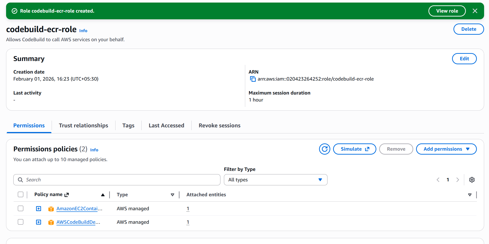
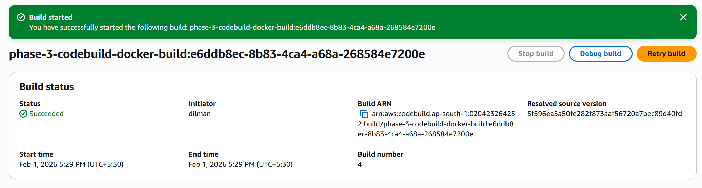
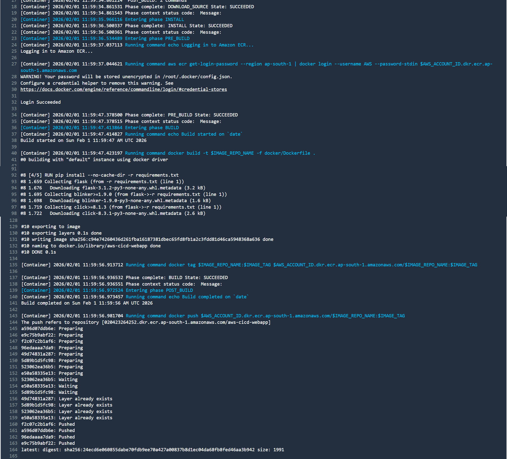
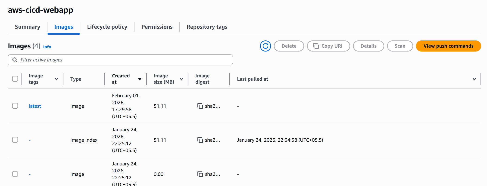

# Phase 3 — Build Automation with AWS CodeBuild

## Objective
Automate the Docker image build process using AWS CodeBuild so that container images are built and pushed to Amazon ECR directly from AWS, without relying on a local development machine.

This phase focuses exclusively on **build automation**, not deployment or full pipeline orchestration.

---

## Overview
In this phase, AWS CodeBuild is introduced to handle the Docker image lifecycle in a controlled and repeatable manner.  
The source code is pulled from GitHub, the Docker image is built using the existing Dockerfile, and the resulting image is pushed to Amazon ECR.

This establishes the foundation required for continuous integration (CI) in later phases.

---

## Key Components Introduced

### AWS CodeBuild
- Fully managed build service
- Executes Docker builds in an isolated environment
- Uses a declarative `buildspec.yml` file
- Integrated with Amazon ECR for image publishing

### Amazon ECR
- Acts as the target registry for CodeBuild-generated images
- Stores versioned Docker images for downstream deployment stages

### IAM Role for CodeBuild
- Service role attached to CodeBuild project
- Permissions include:
  - Building Docker images
  - Pushing images to Amazon ECR
  - Writing logs to CloudWatch
- No long-lived credentials used

---

## Build Specification (`buildspec.yml`)
The build process is defined using a `buildspec.yml` file committed to the repository.  
It includes the following stages:

- **Pre-build**
  - Authenticate Docker to Amazon ECR
- **Build**
  - Build Docker image using the project Dockerfile
  - Tag the image for ECR
- **Post-build**
  - Push the Docker image to Amazon ECR

This ensures consistent and repeatable builds across environments.

---

## Validation Performed

### CodeBuild IAM Role
A dedicated IAM role was created and attached to the CodeBuild project to allow secure interaction with Amazon ECR.

**Evidence:**

---

### CodeBuild Project Configuration
The CodeBuild project was configured with:
- Managed Amazon Linux environment
- Privileged mode enabled for Docker
- Repository connected via GitHub
- `buildspec.yml` used as the build definition

**Evidence:**

---

### Successful Build Execution
A build was triggered manually and completed successfully.

**Evidence:**

---

### Docker Build and Push Logs
Build logs confirm that:
- Docker image was built inside CodeBuild
- Docker image was pushed to Amazon ECR successfully

**Evidence:**

---

### Image Availability in Amazon ECR
The Docker image built by CodeBuild is visible in the ECR repository with a recent push timestamp.

**Evidence:**

---

## Architecture
The Phase 3 architecture introduces automated build flow while keeping deployment out of scope.

---

## Key Decisions
- Build automation introduced before deployment automation
- Docker image built entirely within AWS
- Amazon ECR used as the single source of container artifacts
- EC2 and CodeDeploy intentionally excluded from this phase

---

## Outcome
By the end of Phase 3:
- Docker image builds are fully automated using AWS CodeBuild
- Images are pushed to Amazon ECR without local intervention
- The project now has a true CI foundation

This phase prepares the system for deployment automation using AWS CodeDeploy and pipeline orchestration in subsequent phases.

