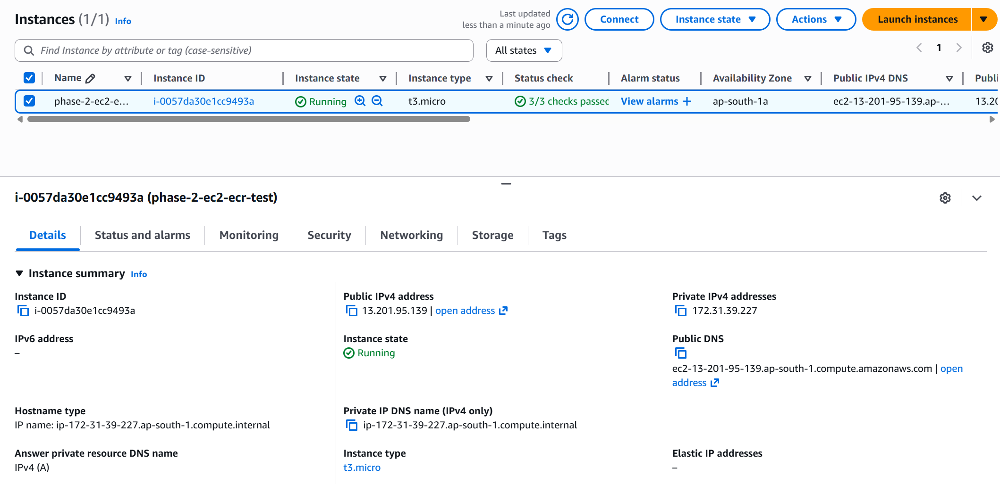
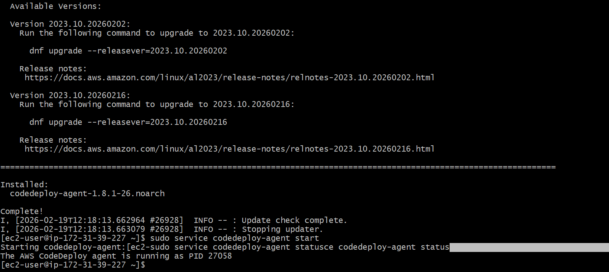
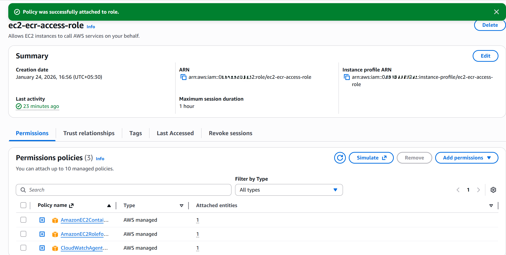
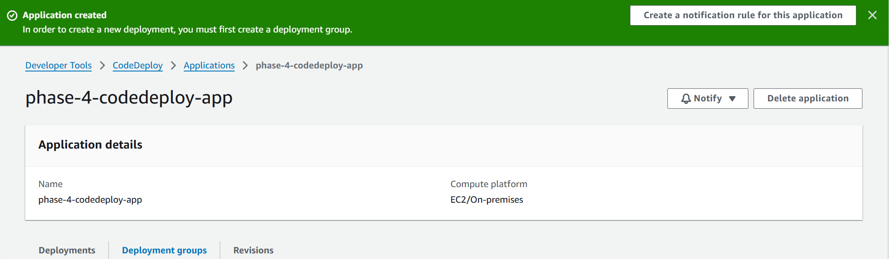
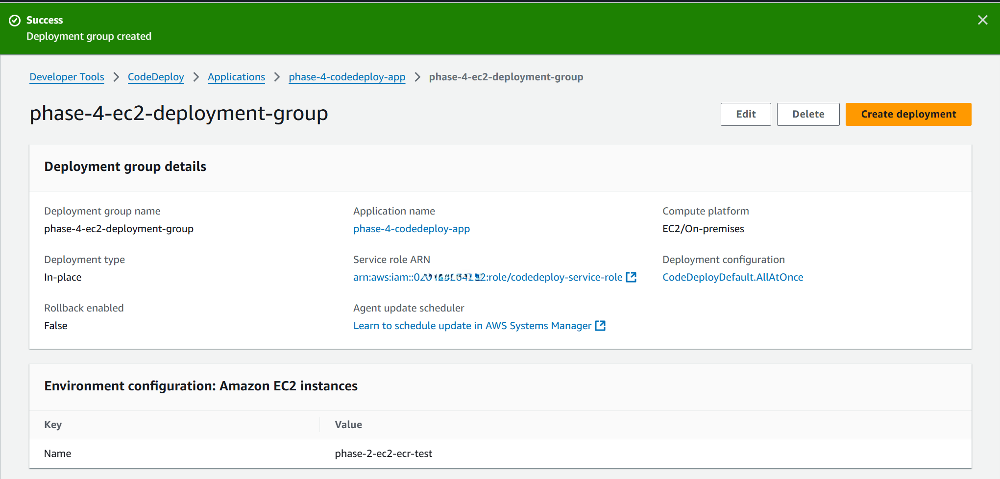
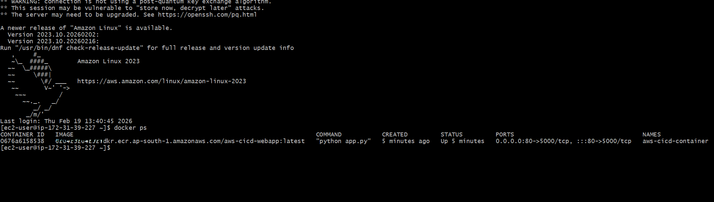
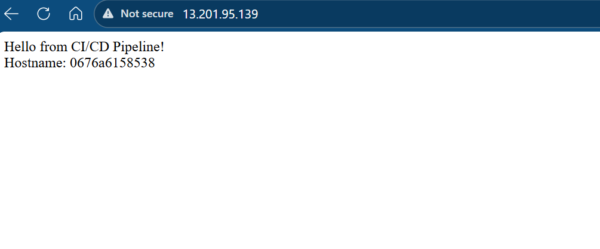

# Phase 4 — Deployment Automation with AWS CodeDeploy

## Objective
Automate the deployment of the Docker image from Amazon ECR to an EC2 instance using AWS CodeDeploy, eliminating manual SSH-based deployment steps.

This phase focuses on **deployment automation (CD)** while keeping orchestration (CodePipeline) out of scope.

---

## Overview
In this phase, AWS CodeDeploy is introduced to automate application deployment to EC2.  
The Docker image built and published in Phase 3 is pulled from Amazon ECR and deployed to the EC2 instance through defined lifecycle hooks.

The deployment process is driven by:
- `appspec.yml`
- Deployment scripts
- CodeDeploy agent running on EC2

---

## Key Components Introduced

### AWS CodeDeploy
- Manages application deployment lifecycle
- Executes deployment hooks on EC2
- Tracks deployment success and failures
- Integrates with S3 for deployment bundles

### CodeDeploy Agent (EC2)
- Installed and running on EC2
- Executes lifecycle hooks defined in `appspec.yml`
- Communicates deployment status back to AWS

### appspec.yml
Defines deployment lifecycle events:

- **ApplicationStop**
  - Stops and removes existing Docker container
- **ApplicationStart**
  - Pulls latest Docker image from ECR
  - Runs container with required port mapping

### Deployment Scripts
- `scripts/stop.sh`
- `scripts/start.sh`

These scripts automate container lifecycle management.

---

## Deployment Flow

1. Deployment bundle uploaded to Amazon S3
2. CodeDeploy triggers deployment
3. EC2 receives deployment instruction
4. CodeDeploy agent executes lifecycle hooks:
   - Stop old container
   - Pull latest image from ECR
   - Start new container
5. Deployment marked as successful

---

## Validation Performed

### EC2 Instance Restarted
The EC2 instance was started for deployment validation.

**Evidence:**

---

### CodeDeploy Agent Running
The CodeDeploy agent was installed and verified to be running on the EC2 instance.

**Evidence:**

---

### EC2 IAM Role Updated
The EC2 IAM role was updated to allow CodeDeploy and ECR access.

**Evidence:**

---

### CodeDeploy Application Created
A CodeDeploy application was created targeting EC2 instances.

**Evidence:**

---

### Deployment Group Configured
A deployment group was created using EC2 instance tags for targeting.

**Evidence:**

---

### Deployment Bundle Stored in S3
Deployment bundle uploaded to Amazon S3 and used as revision source.

**Evidence:**

---

### Successful Deployment Execution
Deployment completed successfully with status marked as `Succeeded`.

**Evidence:**

---

### Docker Container Running on EC2
Post-deployment validation confirmed container running on EC2.

**Evidence:**

---

### Application Accessible via Browser
The application was successfully accessible using the EC2 public IP.

**Evidence:**

---

## Architecture

This phase extends the system by introducing deployment automation between Amazon ECR and EC2 using AWS CodeDeploy.

---

## Key Decisions
- Used S3-based deployment revision for reliability
- Deployment type: In-place
- Single EC2 instance (Free Tier)
- Explicit lifecycle hooks defined in appspec.yml
- EC2 stopped after validation to maintain cost discipline

---

## Outcome
By the end of Phase 4:

- Docker deployment to EC2 is fully automated
- No manual SSH-based deployment required
- Image lifecycle is controlled via AWS services
- The project now has both CI (build) and CD (deployment) automation

The only remaining step to complete the end-to-end pipeline is orchestration using AWS CodePipeline.
