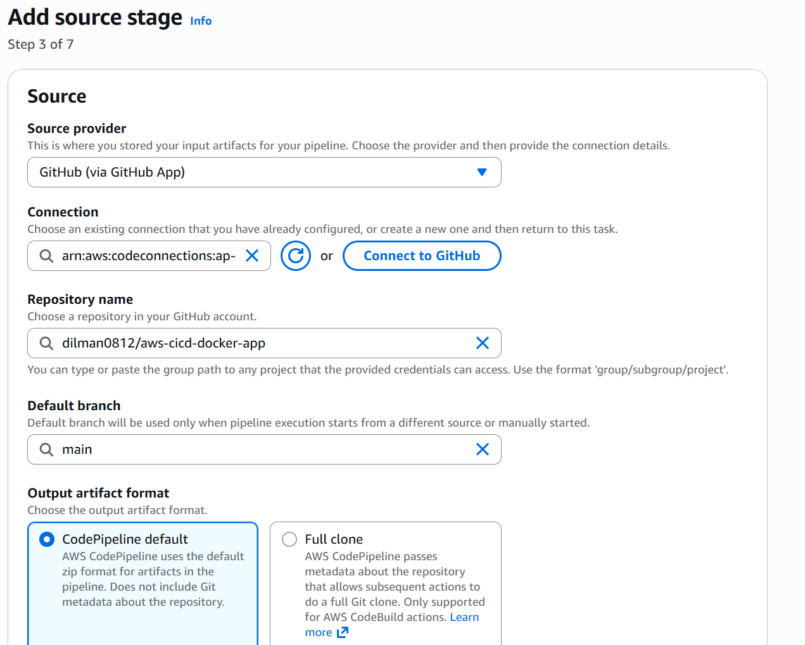
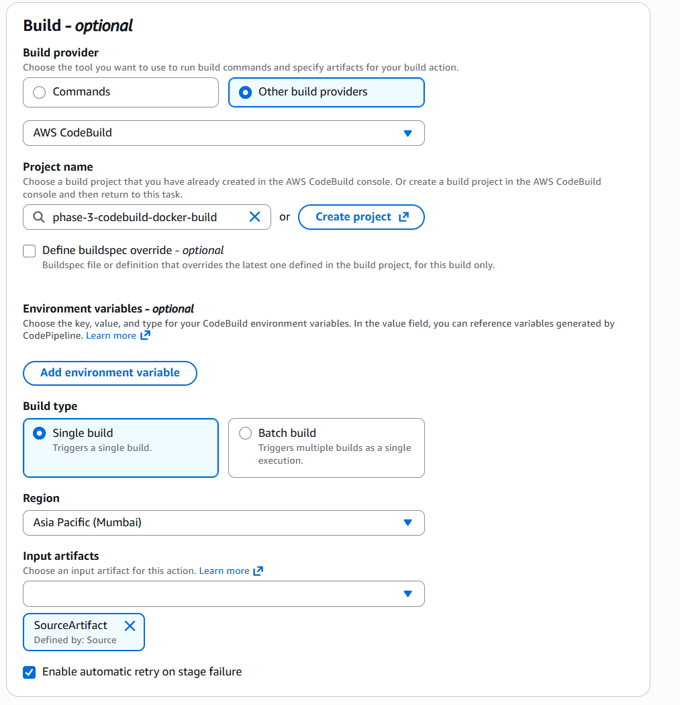
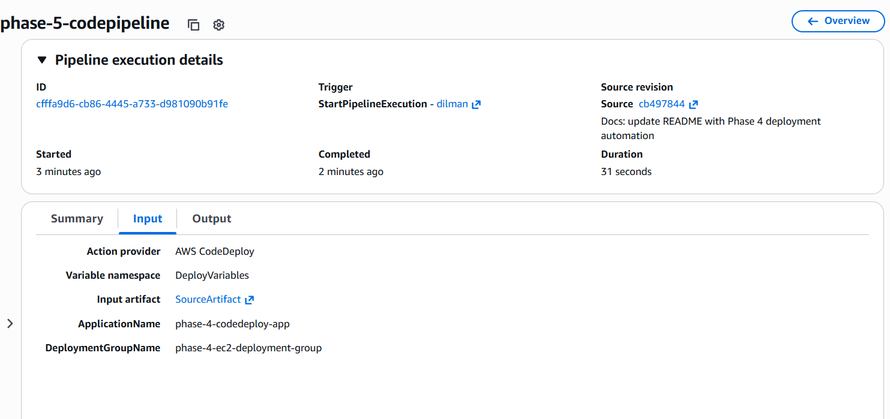
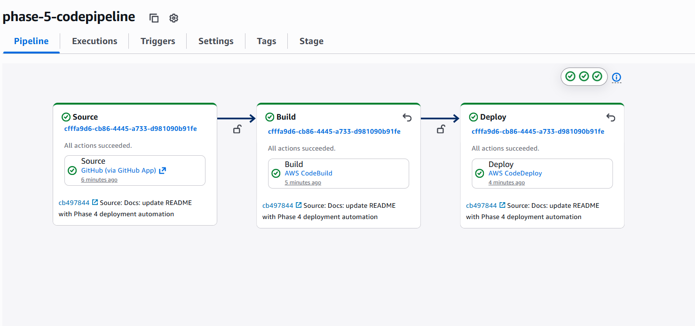
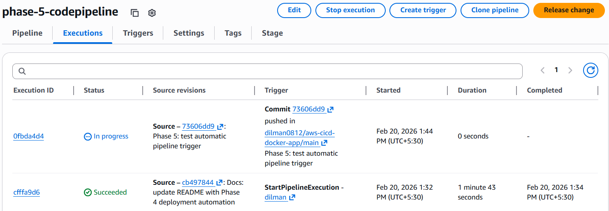
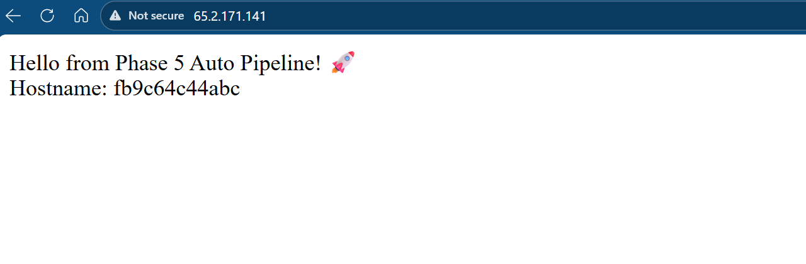

# Phase 5 — End-to-End CI/CD Orchestration (AWS CodePipeline)

## Objective

Introduce AWS CodePipeline to orchestrate the complete CI/CD workflow so that a GitHub push automatically triggers build and deployment without manual intervention.

This phase transforms the system from semi-automated CI/CD into a fully automated pipeline.

---

## Architecture

In this phase:

GitHub → CodePipeline → CodeBuild → Amazon ECR → CodeDeploy → EC2

CodePipeline acts as the central orchestrator coordinating all previously configured services.

---

## Pipeline Configuration

### 1️⃣ Source Stage

Provider: GitHub (Version 2)  
Repository: aws-cicd-docker-app  
Branch: main  
Change Detection: GitHub Webhook (automatic trigger enabled)

Screenshot:  

---

### 2️⃣ Build Stage

Provider: AWS CodeBuild  
Project: phase-3-codebuild-docker-build  

Responsibilities:
- Pull source code
- Build Docker image
- Authenticate to Amazon ECR
- Push latest image

Screenshot:  

---

### 3️⃣ Deploy Stage

Provider: AWS CodeDeploy  
Application: phase-4-codedeploy-app  
Deployment Group: phase-4-ec2-deployment-group  

Responsibilities:
- Execute lifecycle hooks
- Authenticate EC2 to ECR
- Pull latest Docker image
- Restart container

Screenshot:  

---

## Critical Fix — ECR Authentication in Deployment

During initial deployment attempts, deployments failed with the error:

Your authorization token has expired. Reauthenticate and try again.

Root Cause:  
ECR login tokens expire after 12 hours. The EC2 instance was not re-authenticating before pulling images during deployment.

Solution:  
ECR login was added inside the start.sh lifecycle script so that each deployment generates a fresh authentication token using the EC2 IAM role.

The script now performs:

- Generate login password using AWS CLI  
- Authenticate Docker to Amazon ECR  
- Stop and remove existing container  
- Pull latest image  
- Start new container  

This ensures secure, temporary, IAM-based authentication without storing any credentials in the repository.

---

## Automatic Trigger Validation

To validate full automation:

1. Modified application response in app.py  
2. Committed and pushed to GitHub  
3. Observed automatic pipeline execution  
4. Verified updated response in browser  

Screenshot — Successful Pipeline Execution:  

Screenshot — Auto Trigger Execution:  

Screenshot — Updated Browser Output:  

---

## Deployment Flow Summary

1. Developer pushes code to GitHub  
2. CodePipeline webhook triggers execution  
3. CodeBuild builds Docker image  
4. Image pushed to Amazon ECR  
5. CodeDeploy triggers lifecycle hooks  
6. EC2 logs into ECR using IAM role  
7. Latest image pulled  
8. Container restarted  
9. Application updated live  

No manual SSH.  
No manual Docker commands.  
No manual deployment.

---

## Security Considerations

- EC2 uses IAM role (no static AWS access keys)  
- ECR authentication handled via IAM and temporary tokens  
- SSH restricted to My IP  
- HTTP exposed only for application validation  
- No credentials stored in repository  

---

## Cost Awareness

After validation:

- EC2 instance stopped to prevent unnecessary charges  
- CodePipeline retained for documentation purposes  
- No active compute resources running  

---

## Phase 5 Outcome

By the end of Phase 5:

- Continuous Integration implemented using AWS CodeBuild  
- Continuous Deployment implemented using AWS CodeDeploy  
- Full CI/CD orchestration implemented using AWS CodePipeline  
- Secure image authentication handled automatically  
- Deployment fully automated from GitHub push  

This completes the end-to-end AWS CI/CD pipeline for a Dockerized web application.
